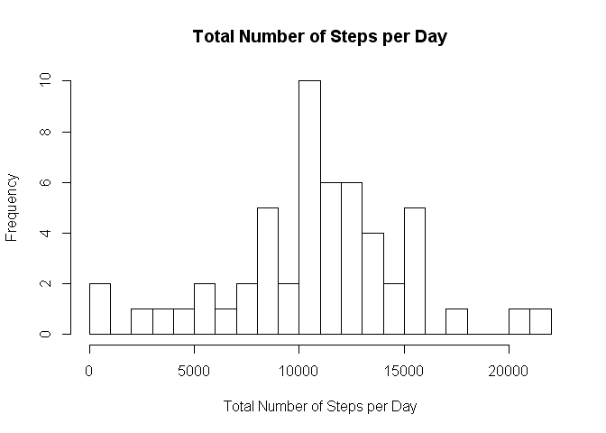
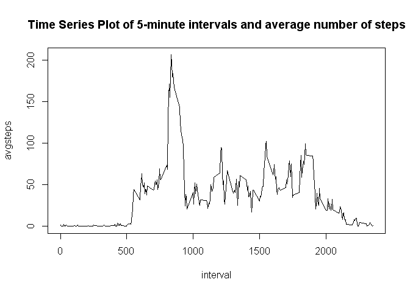
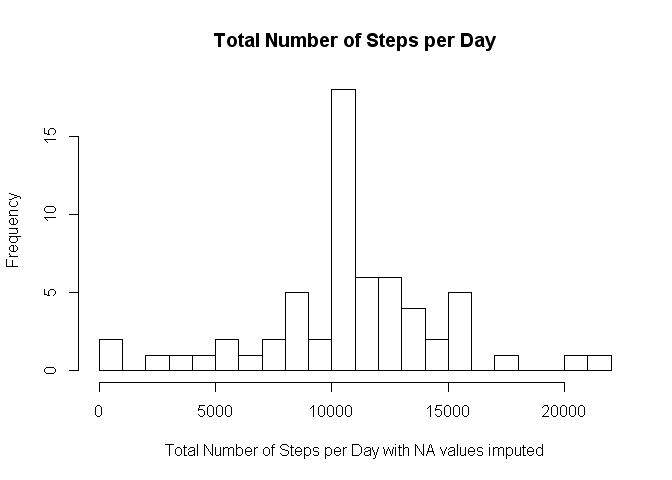
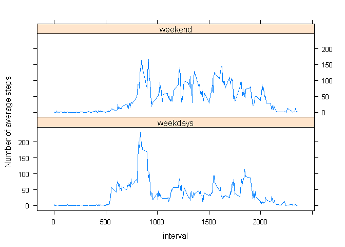

#### Reproducible Research: Peer Assignment 1
#### Author: Nadya Filipova
#### Date: Saturday, July 12, 2014

=========================================================

The goal of this analysis is initial exploratory investigation of the Activity data.


##### 1. Loading and modifying the raw data.


```r
mydata<-read.csv("C:/Documents and Settings/Nadya/Desktop/coursera/reproducible_research/activity.csv")
```

Some initial exploratory investigation of the data shows that there are 17,568 observations and 3 variables, of them two integer and one factor variable. Summary statistics are presented below.


```r
names(mydata)
```

```
## [1] "steps"    "date"     "interval"
```

```r
head(mydata,5)
```

```
##   steps       date interval
## 1    NA 2012-10-01        0
## 2    NA 2012-10-01        5
## 3    NA 2012-10-01       10
## 4    NA 2012-10-01       15
## 5    NA 2012-10-01       20
```

```r
dim(mydata)
```

```
## [1] 17568     3
```

```r
class(mydata)
```

```
## [1] "data.frame"
```

```r
summary(mydata)
```

```
##      steps               date          interval   
##  Min.   :  0.0   2012-10-01:  288   Min.   :   0  
##  1st Qu.:  0.0   2012-10-02:  288   1st Qu.: 589  
##  Median :  0.0   2012-10-03:  288   Median :1178  
##  Mean   : 37.4   2012-10-04:  288   Mean   :1178  
##  3rd Qu.: 12.0   2012-10-05:  288   3rd Qu.:1766  
##  Max.   :806.0   2012-10-06:  288   Max.   :2355  
##  NA's   :2304    (Other)   :15840
```

```r
table(mydata$date)
```

```
## 
## 2012-10-01 2012-10-02 2012-10-03 2012-10-04 2012-10-05 2012-10-06 
##        288        288        288        288        288        288 
## 2012-10-07 2012-10-08 2012-10-09 2012-10-10 2012-10-11 2012-10-12 
##        288        288        288        288        288        288 
## 2012-10-13 2012-10-14 2012-10-15 2012-10-16 2012-10-17 2012-10-18 
##        288        288        288        288        288        288 
## 2012-10-19 2012-10-20 2012-10-21 2012-10-22 2012-10-23 2012-10-24 
##        288        288        288        288        288        288 
## 2012-10-25 2012-10-26 2012-10-27 2012-10-28 2012-10-29 2012-10-30 
##        288        288        288        288        288        288 
## 2012-10-31 2012-11-01 2012-11-02 2012-11-03 2012-11-04 2012-11-05 
##        288        288        288        288        288        288 
## 2012-11-06 2012-11-07 2012-11-08 2012-11-09 2012-11-10 2012-11-11 
##        288        288        288        288        288        288 
## 2012-11-12 2012-11-13 2012-11-14 2012-11-15 2012-11-16 2012-11-17 
##        288        288        288        288        288        288 
## 2012-11-18 2012-11-19 2012-11-20 2012-11-21 2012-11-22 2012-11-23 
##        288        288        288        288        288        288 
## 2012-11-24 2012-11-25 2012-11-26 2012-11-27 2012-11-28 2012-11-29 
##        288        288        288        288        288        288 
## 2012-11-30 
##        288
```

```r
sapply(mydata,class)
```

```
##     steps      date  interval 
## "integer"  "factor" "integer"
```

The date variable is a factor variable and we need to convert it to a date variable.


```r
mydata$date<-as.Date(mydata$date)
class(mydata$date)
```

```
## [1] "Date"
```


##### 2. Total number of steps per day

Histogram of Total Number of Steps per Day and summary statistics  are presented below:


```r
totalsteps<-as.vector(tapply(mydata$steps,mydata$date,sum))
hist(totalsteps,breaks=20,xlab="Total Number of Steps per Day",main="Total Number of Steps per Day")
```

 

```r
summary(totalsteps,digits=5)
```

```
##    Min. 1st Qu.  Median    Mean 3rd Qu.    Max.    NA's 
##      41    8841   10765   10766   13294   21194       8
```

The mean is 10,766, and the median 10,765 total steps per day which indicates almost symmetrical distribution. This excludes missing values. If we leave the NA values in the calculations, the results of the mean and median are NAs.


##### 3. Average daily activity pattern

To create a time series plot of average number of steps per 5-minute interval we first need to modify the data. Average number of steps per 5-minute interval will be used later to impute missing values.


```r
dataday<-tapply(mydata$steps,mydata$interval,mean,na.rm=TRUE)
dataday<-cbind(as.numeric(rownames(dataday)),as.data.frame(dataday))
names<-c("interval","avgsteps")
colnames(dataday)<-names

class(dataday$interval)
```

```
## [1] "numeric"
```

```r
class(dataday$avgsteps)
```

```
## [1] "array"
```

Time series plot of the average number of steps in 5-minute intervals is presented below:


```r
plot(dataday, type="l",main="Time Series Plot of 5-minute intervals and average number of steps")
```

 

```r
tail(dataday[order(dataday$avgsteps),],1)
```

```
##     interval avgsteps
## 835      835    206.2
```

The 835th 5-minute interval has the largest average number of steps.


##### 4. Imputing missing values

Missing values by variable are presented below. 


```r
sapply(mydata, function(x) sum(is.na(x)))
```

```
##    steps     date interval 
##     2304        0        0
```

```r
bad<-mydata[!complete.cases(mydata),]
summary(bad)
```

```
##      steps           date               interval   
##  Min.   : NA    Min.   :2012-10-01   Min.   :   0  
##  1st Qu.: NA    1st Qu.:2012-10-26   1st Qu.: 589  
##  Median : NA    Median :2012-11-06   Median :1178  
##  Mean   :NaN    Mean   :2012-11-01   Mean   :1178  
##  3rd Qu.: NA    3rd Qu.:2012-11-11   3rd Qu.:1766  
##  Max.   : NA    Max.   :2012-11-30   Max.   :2355  
##  NA's   :2304
```

There are 2,304 records with missing steps in the dataset. We will impute the missing values with the average number of steps for that 5-minute interval. Histogram of the imputed data reveals that the distribution is still approximately symmetrical with long left and right tail.


```r
total<-merge(mydata,dataday,by="interval")

modified<- transform(total, stepsimpute = ifelse(!is.na(steps), steps, avgsteps))
modified<-modified[order(modified$date),]
totalm<-as.vector(tapply(modified$stepsimpute,modified$date,sum))
hist(totalm,breaks=20,xlab="Total Number of Steps per Day with NA values imputed",main="Total Number of Steps per Day")
```

 


##### 5. Differences in activity pattern between weekdays and weekends.

We need to create a new factor variable for days of the week,


```r
modified$days<-factor(weekdays(modified$date))
modified$weekdays<-modified$days
levels(modified$days)
```

```
## [1] "Friday"    "Monday"    "Saturday"  "Sunday"    "Thursday"  "Tuesday"  
## [7] "Wednesday"
```

```r
levels(modified$weekdays)<-c("weekday","weekday","weekend","weekend","weekday","weekday","weekday")
```

Check the dataset with all derived variables.


```r
sapply(modified,class)
```

```
##    interval       steps        date    avgsteps stepsimpute        days 
##   "integer"   "integer"      "Date"     "array"   "numeric"    "factor" 
##    weekdays 
##    "factor"
```

```r
summary(modified)
```

```
##     interval        steps            date               avgsteps     
##  Min.   :   0   Min.   :  0.0   Min.   :2012-10-01   Min.   :  0.00  
##  1st Qu.: 589   1st Qu.:  0.0   1st Qu.:2012-10-16   1st Qu.:  2.49  
##  Median :1178   Median :  0.0   Median :2012-10-31   Median : 34.11  
##  Mean   :1178   Mean   : 37.4   Mean   :2012-10-31   Mean   : 37.38  
##  3rd Qu.:1766   3rd Qu.: 12.0   3rd Qu.:2012-11-15   3rd Qu.: 52.83  
##  Max.   :2355   Max.   :806.0   Max.   :2012-11-30   Max.   :206.17  
##                 NA's   :2304                                         
##   stepsimpute           days         weekdays    
##  Min.   :  0.0   Friday   :2592   weekday:12960  
##  1st Qu.:  0.0   Monday   :2592   weekend: 4608  
##  Median :  0.0   Saturday :2304                  
##  Mean   : 37.4   Sunday   :2304                  
##  3rd Qu.: 27.0   Thursday :2592                  
##  Max.   :806.0   Tuesday  :2592                  
##                  Wednesday:2592
```

Time series plots by type of day is presented below.


```r
dataweekend<-subset(modified,weekdays=="weekend")
dataweekdays<-subset(modified,weekdays=="weekday")
names<-c("interval","avgsteps")

dataweekendplot<-tapply(dataweekend$stepsimpute,dataweekend$interval,mean)
dataweekendplot<-cbind(as.numeric(rownames(dataweekendplot)),as.data.frame(dataweekendplot))
colnames(dataweekendplot)<-names

dataweekdaysplot<-tapply(dataweekdays$stepsimpute,dataweekdays$interval,mean)
dataweekdaysplot<-cbind(as.numeric(rownames(dataweekdaysplot)),as.data.frame(dataweekdaysplot))
colnames(dataweekdaysplot)<-names
```

A version of the trellis plot with the package "lattice" is presented below.


```r
dataweekendplot$days<-rep("weekend",times=nrow(dataweekendplot))
dataweekdaysplot$days<-rep("weekdays",times=nrow(dataweekdaysplot))
final<-rbind(dataweekdaysplot,dataweekendplot)
summary(final)
```

```
##     interval       avgsteps          days          
##  Min.   :   0   Min.   :  0.00   Length:576        
##  1st Qu.: 589   1st Qu.:  2.05   Class :character  
##  Median :1178   Median : 28.13   Mode  :character  
##  Mean   :1178   Mean   : 38.99                     
##  3rd Qu.:1766   3rd Qu.: 61.26                     
##  Max.   :2355   Max.   :230.38
```

```r
library(lattice)
xyplot(avgsteps~interval|days,final,type="l",layout=c(1,2),ylab="Number of average steps")
```

 
